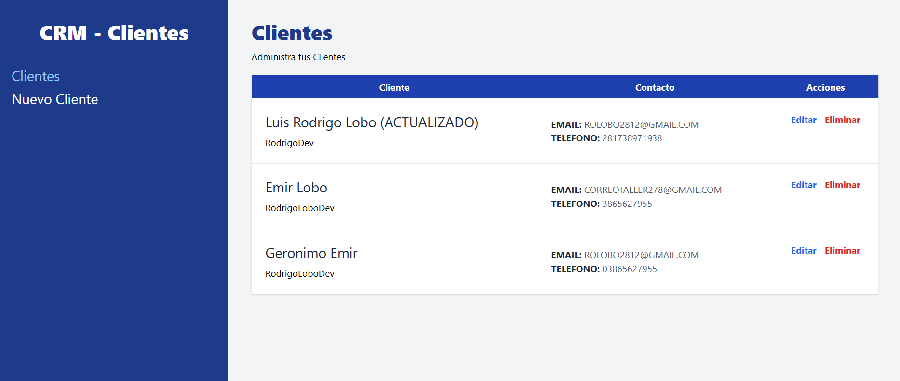

<!-- Banner -->


# 👋 ¡Hola gracias por visitar mi Proyecto!

## 🚀 Proyecto: CRM Clientes

Este es el frontend de **CRM Clientes**, una aplicación web diseñada para gestionar clientes de manera eficiente. Con esta aplicación, puedes visualizar, agregar, modificar y eliminar clientes, proporcionando una solución práctica para la administración de datos.

## 🛠️ Tecnologías Utilizadas

- **React**: Librería para construir interfaces de usuario de forma modular y eficiente.
- **React Router DOM**: Manejo de rutas dentro de la aplicación para una navegación fluida entre páginas.
- **Tailwind CSS**: Framework de CSS para estilizar la aplicación de manera rápida y consistente.
- **JSON Server**: Servidor de datos falso para simular una API REST y gestionar los datos de los clientes durante el desarrollo.

## 🎥 Demostración

Puedes ver una demostración en video de cómo funciona la aplicación en [este enlace de YouTube](https://www.youtube.com).

## 📝 Funcionalidades Principales

- **Visualización de Clientes**: Los clientes se muestran en una tabla organizada, con columnas para el nombre, email, teléfono y acciones.
- **Agregar y Modificar Clientes**: Un solo formulario permite tanto agregar nuevos clientes como modificar los existentes de manera sencilla.
- **Eliminar Clientes**: Los clientes pueden ser eliminados con confirmación para evitar errores accidentales.
- **Búsqueda y Filtrado**: Funcionalidades avanzadas de búsqueda y filtrado para encontrar rápidamente la información deseada.


## 📂 Estructura del Proyecto

```bash
src/
├── api/              # Interacción con la api de JSON SERVER
├── components/       # Componentes
├── helpers/          # Funcionalidades extras de ayuda
├── img/              # Imagenes
├── layouts/          # Layout Principal
└── pages/            # Páginas de la aplicación
```
## 🚀 Cómo Empezar
1. Clona el repositorio:

```bash
git clone https://github.com/RodrigoLoboDev/REST_API_FRONTEND-PRODUCTS
```
2. Instala las dependencias:

```bash
npm install
```

3. Inicia el servidor JSON para simular la API:

```bash
npx json-server db.json
```
#### Explicación:

Este comando ejecuta JSON Server utilizando el archivo db.json como fuente de datos.
Asegúrate de que el archivo db.json esté en el directorio raíz del proyecto.
Por defecto, el servidor se ejecutará en http://localhost:3000.

4. Inicia el servidor de desarrollo:

```bash
npm run dev
```

## 🤝 Contribuciones
Las contribuciones son bienvenidas. Si tienes ideas para mejorar el proyecto, no dudes en abrir un issue o hacer un pull request.

## 📧 Contacto
- Email: rolobo2812@gmail.com
- LinkedIn: [Jesús Luis Rodrigo Lobo](https://www.linkedin.com/in/jes%C3%BAs-luis-rodrigo-lobo-6594a81b4/)
- GitHub: [RodrigoLoboDev](https://github.com/RodrigoLoboDev)

#### ⭐️ Si te gusta lo que hago, no dudes en seguirme y contribuir a mis proyectos. ⭐️